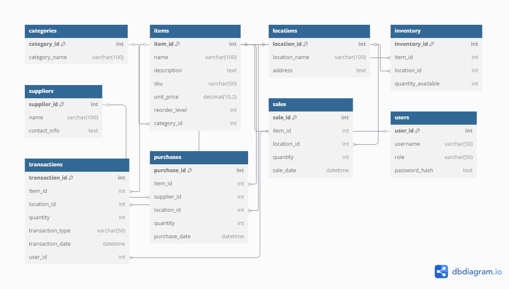

# 📦 Inventory Tracking System

## 📋 Project Description

The Inventory Tracking System is a simple MySQL-based database application designed to manage and track items, categories, stock levels, suppliers, purchases, and sales across multiple store locations. It supports inventory transactions and includes role-based user management for administrative and warehouse staff.

This project is ideal for small to medium businesses looking to maintain clear visibility of their inventory flow and performance.

---
## 🗺️ Entity Relationship Diagram

Below is the ER diagram representing the database structure of the Inventory Tracking System:



## 🚀 Features

- Categorization of items (e.g., Electronics, Stationery, Furniture)
- Inventory tracking across multiple store locations
- Supplier and purchase management
- Sales logging and stock level tracking
- Transaction logging (purchases, sales, adjustments)
- User role definitions for admin and warehouse managers

---

## 🛠️ How to Run / Set Up the Project

### Requirements:
- MySQL Server (v5.7+ recommended)
- MySQL Client (e.g., MySQL Workbench, phpMyAdmin, or command-line interface)

### Steps:

1. **Create the Database**
   ```sql
   CREATE DATABASE inventoryTrackingDB;

2. **Switch to the Database**
    ```sql
    USE inventoryTrackingDB;
3. **Copy and paste the full SQL setup script (from this project) into your MySQL client.**

4. **Verify tables**
    ```sql
    SHOW TABLES;